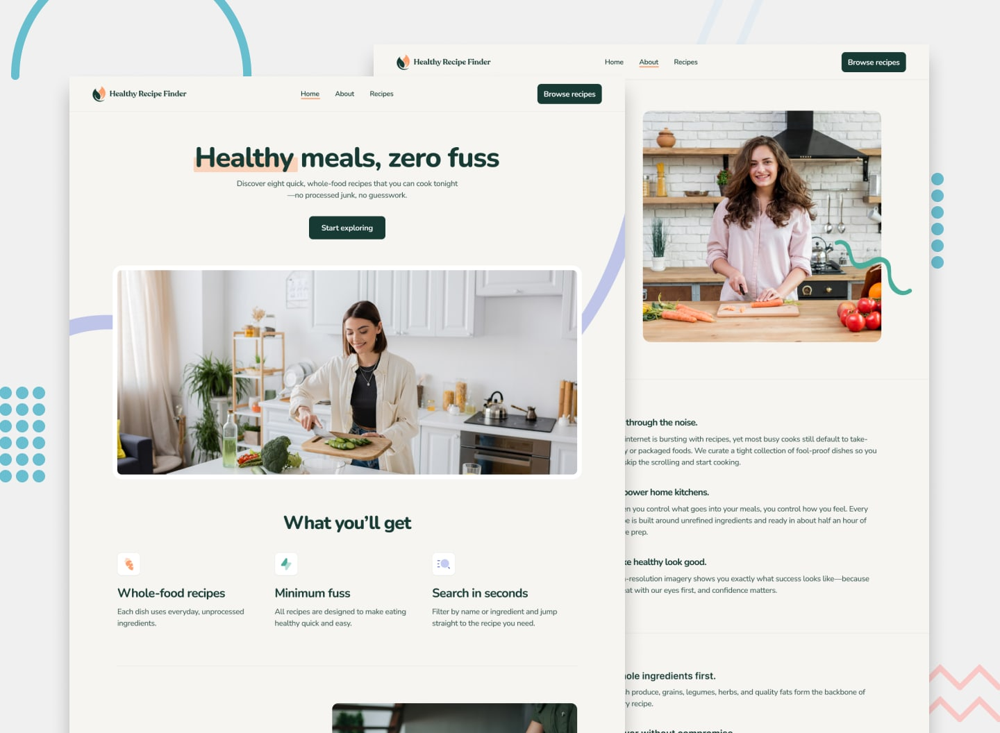

# Frontend Mentor - Recipe finder website solution

This is a solution to the [Recipe finder website challenge on Frontend Mentor](https://www.frontendmentor.io/challenges/recipe-finder-website--Ui-TZTPxN). Frontend Mentor challenges help you improve your coding skills by building realistic projects.

## Overview

### The challenge

Users should be able to:

- View the home, about, recipes index, and recipe detail pages
- Search for recipes by name or ingredient
- Filter recipes by max prep or cook time
- View the optimal layout for the interface depending on their device's screen size
- See hover and focus states for all interactive elements on the page

### Screenshot

### Links

- Solution URL: [here](https://fm-7-recipe-finder.vercel.app/)
- Live Site URL: [here](https://fm-7-recipe-finder.vercel.app/)

## My process

### Built with

- Semantic HTML5 markup
- CSS custom properties
- Flexbox
- CSS Grid
- Mobile-first workflow
- [React](https://reactjs.org/)
- Typescript
- Vite
